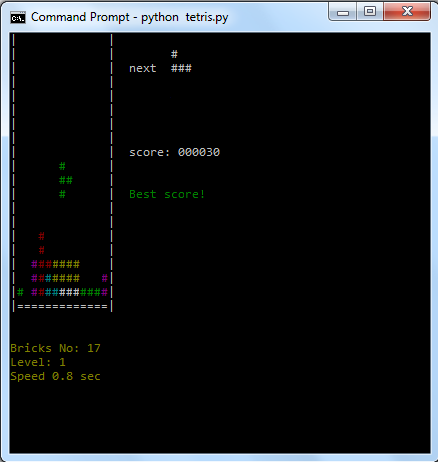

# PyTetris
A simple, console version of a popular game implemented in Python. The game implements different levels and a high score which is stored in a SQLite database.

## Screenshots

## Controlls
- **A** and **D** keys - horizontal movement
- **W** key - rotate
- **S** key - drop pieces faster

## Compatibility
Since the program uses *colorama* and *win32api* modules, it can be run on the Windows platform only.